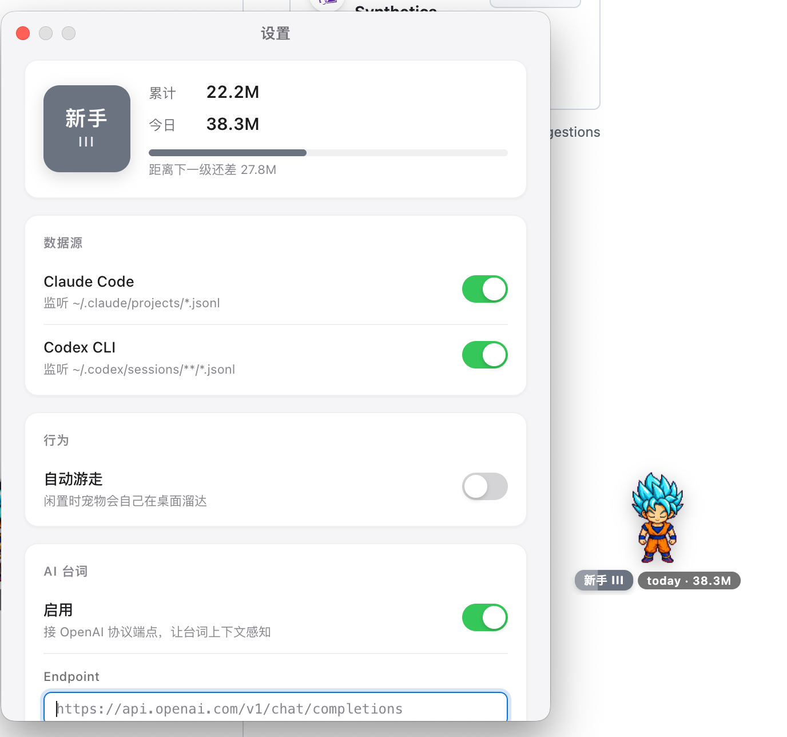

[English](./README.md) | **简体中文**

# nom

一只住在桌面上的宠物，**吃掉你消耗的 AI token** —— 当前从 Claude Code 和 Codex CLI 取食（Cursor 适配在路上）。

> **隐私优先**：nom 不向任何地方上传你的数据。它只读用量数字（不读 prompt/response），所有状态存在你机器上的 `~/.nom/`，随时可以 `rm -rf ~/.nom` 清空。



## 功能

- **实时吃多源 token** —— 同时监听 `~/.claude/projects/*.jsonl`（Claude Code）和 `~/.codex/sessions/**/*.jsonl`（Codex CLI），每个源右键菜单可独立开关。
- **新会话问候** —— 你打开新 Claude Code 会话，宠物会醒过来打招呼。
- **自动游走** —— 没事自己在桌面溜达两步，像个真实的桌面伙伴（右键可关）。
- **支持换皮** —— 用 `npx petdex install <slug>` 装 [petdex](https://github.com/crafter-station/petdex) 包，再右键 → **选择宠物** 秒切，不用重启。
- **闲置睡觉、回来唤醒** —— 30 分钟没动静就打盹。
- **聊天卡气泡** —— 新会话、里程碑、点击聊天、随机吃东西评论，都用聊天卡片样式（粗体标题 + 灰色正文）。默认本地预置台词；**可选**接 LLM 让台词动态、上下文感知（见下面）。
- **拖动** 任意位置即可移动；窗口位置重启不丢。
- **多屏友好** —— `⌘⌥N` 一键召回到鼠标所在屏幕。

## 安装（最终用户）

下面这些链接**永远指向最新版**，存一次就行，不用每次发版都换：

### macOS

- **Apple Silicon（M1/M2/M3/M4）**：[`nom-arm64.dmg`](https://github.com/dylan-labs/nom-pet/releases/latest/download/nom-arm64.dmg)
- **Intel Mac**：[`nom-x64.dmg`](https://github.com/dylan-labs/nom-pet/releases/latest/download/nom-x64.dmg)

把 `nom.app` 拖进 `/Applications`。首次打开 macOS 会拦截 —— 打开 **系统设置 → 隐私与安全性**，拉到底，点 nom 旁边的 **仍然打开**，弹窗里再确认一次就行，以后双击直接启动。

### Windows

- [`nom-setup.exe`](https://github.com/dylan-labs/nom-pet/releases/latest/download/nom-setup.exe) —— NSIS 安装向导，x64

双击 setup，走完向导。桌面会有快捷方式，开始菜单也能找到。

> 想看历史版本：[Releases 页面](../../releases)

## 换宠物皮肤

到 **[petdex.crafter.run](https://petdex.crafter.run/zh)** 浏览所有可装的宠物，安装：

```bash
npx petdex install boba       # 或 doraemon、goku-blue……
```

右键宠物 → **选择宠物** → 选你新装的。宠物文件存在 `~/.codex/pets/<slug>/` 和 `~/.nom/pets/<slug>/`。

## 右键菜单

| 选项 | 作用 |
|---|---|
| ☑ 允许游走 | 自动游走开/关 |
| ☐ AI 台词 | LLM 动态台词开/关（见下面）|
| 数据源 → | 各个源独立开关（Claude Code、Codex）|
| 选择宠物 → | 在已装的 petdex 皮肤之间切换 |
| 打开配置文件 | 打开 `~/.nom/state.json` 手动编辑 |
| 关闭宠物 | 退出 |

另外有全局快捷键：`⌘⌥N`（Mac）/ `Ctrl+Alt+N`（Win），把宠物召回到当前屏幕。

## 可选：AI 动态台词

默认 nom 用本地预置台词文件 —— 完全离线、可重复、零网络。如果你想要上下文感知的台词（比如 *"凌晨两点了还在用 Claude，你这个 prompt 写得有点暴躁啊"*），可以接任何 **OpenAI 协议的 chat-completions 端点** —— 你自己的 Anthropic key、本机 Ollama、自建模型……只要对得上 OpenAI 接口就行。

1. 右键宠物 → 勾上 **AI 台词**
2. 右键 → **打开配置文件**（会打开 `~/.nom/state.json`）
3. 编辑 `llm` 那一节：
   ```json
   "llm": {
     "enabled": true,
     "endpoint": "https://api.anthropic.com/v1/...",
     "model": "claude-haiku-4-5-20251001",
     "apiKey": "sk-..."
   }
   ```
4. 退出 nom 重新启动。

**隐私契约**：只发元数据（触发类型、时段、token 数字）出去，**绝不发**你的 prompt 和 Claude 的回复。任何 LLM 调用失败 / 超时 → 静默回退本地台词，宠物照常工作。

## 开发

```bash
npm install
npm run dev          # electron-vite dev 模式（带 HMR）
npm run typecheck    # tsc --noEmit
npm run pack:mac     # 打 .dmg → release/
npm run pack:win     # 打 .exe → release/
```

需要 Node ≥ 18。

架构、技术决策和理由见 [`CLAUDE.md`](./CLAUDE.md)。产品范围和不做的事见 [`PRODUCT.md`](./PRODUCT.md)。

## 隐私

nom 在隐私上是偏执的：

1. **默认零网络请求**。基础体验完全离线 —— 全部从你本机的 Claude Code 文件读。唯一可能联网的是上面那个可选的 AI 台词功能，**只有你主动开启并配置 endpoint 才会发请求**。
2. **从不读取或发送 prompt/response 内容**。nom 只解析 JSONL 里的 `usage.{input,output,cache_*}_tokens` 数字。开 AI 台词后，发给 LLM 端点的也只有元数据（触发类型、时间、数字），**绝不**包含对话本身。
3. **所有状态本地**。`~/.nom/state.json` 是人可读 JSON，删掉就完全重置。

## 许可证

源码用 [MIT](./LICENSE)。打包进去的 sprite 素材有各自的许可证，见 [`CREDITS.md`](./CREDITS.md)。
